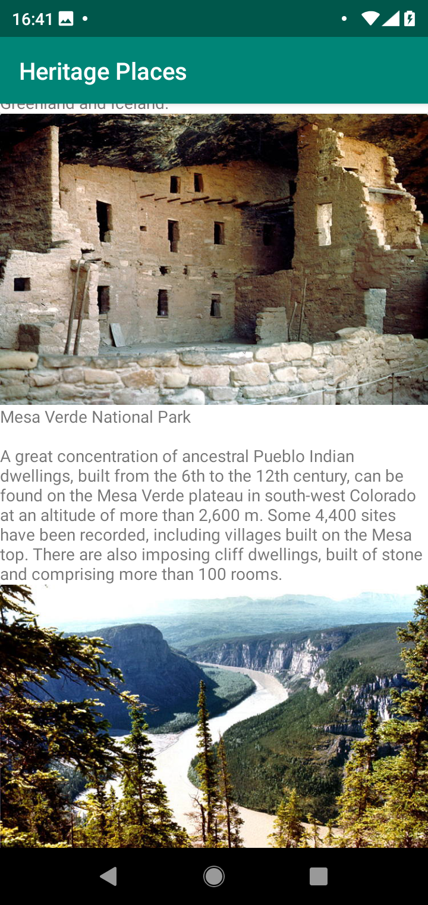
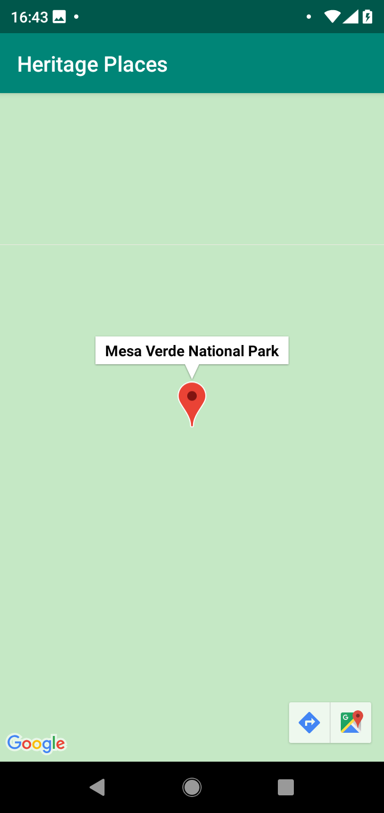

# Table of Contents: 

1. [Intro](#world-heritage-places)
2. [Broken Image Links](#broken-image-links)
3. [Architecture](#architecture)
4. [Assumptions](#assumptions)
5. [Data Paging Implementation (also includes unit tests)](#paging-implementation)
6. [UI Tests](#ui-tests)
7. MainVM tests exist but the VM itself is incredibly concise, UI tests matter more here.
8. [Maps Implementation](#maps-implementation)

Tap on an item in the table of contents, or scroll past the images to see a quick overview.

List of Places   | Tapped Place on a Map
:----------:|:--------------:
The list that is shown once the data is loaded | Tapping an item opens it in an embedded map with a marker (tap the marker to show the name)
 | 

### World Heritage Places

The app shows a list of heritage places, with their images, their name and a short description. Clicking on an item, shows its location on a map.

Data is incrementally loaded but serially displayed. I believe it's a good UX choice to not interrupt users scrolling infinitely through their data, while still batching and
paging the load of that data.

### Broken Image Links
Glide will attempt to load the image, it will show:
* A loading image.
* If the image link is broken, as a lot of the unseco links are, this image will be shown 
* If the image loads, then the image itself
 
### Architecture
The app uses a hybrid MVVM-MVI architecture, with a shared viewmodel that's injected via Dagger into the Loading, Error and HeritageList fragments.

The navigation architecture component is used to cleanly separate the code for each of those and fragments are started by ViewState triggers from the [MainVm](app/src/main/java/com/aniketkadam/heritageplaces/MainVm.kt)
[MainActivity](app/src/main/java/com/aniketkadam/heritageplaces/MainActivity.kt) is where the navigation happens.

Tests are used where my logic is added.

### Assumptions

The current implementation is what I'd do to execute the given techincal specification given with the least code possible. This means that instead of implementing an Arch Components BoundaryCallback over the network, and a Room database to store what I receive, I'm going to directly create a custom data source to page the json. 

For an open source project where I page an infinite list of items from the network into a database and then into a recyclerview, please look at https://github.com/AniketSK/Appod

While a ViewPager could've been used, notably ViewPager2 is also implemented via a RecyclerView. I chose this for a better user experience than separate feeling pages that have to be swiped through.

If a viewpager and distinct pages are indeed what's desired, please let me know and I'll do it that way. 

### Paging Implementation
The first thing you'll notice, is that there aren't any separate screens for the page numbers.
This is because while the data is incrementally loaded, the list remains the same.

**As the user scrolls, earlier pages of loaded items are thrown out of the pool. Only rows of 20 are kept.**

This is achieved via the [PagedHeritagePlaceAdapter](app/src/main/java/com/aniketkadam/heritageplaces/PagedHeritagePlaceAdapter.kt).

In this app, the data is paged via a custom [DataSource](app/src/main/java/com/aniketkadam/heritageplaces/JsonPagedDataSource.kt) that I wrote which extends the Android Architecture Components DataSource for PagedLists.

All data loads happen asynchronously via RxJava.

This DataSource handles the splitting and incremental loading of the json, for which there are [tests](app/src/test/java/com/aniketkadam/heritageplaces/JsonPagedDataSourceTest.kt).
While a full load of the json data exists, it wouldn't be normally done.

To see another open source app, where I do incremental data load from the network, add it to the database, and use Room's built in DataSource Factory to page an infinite list, please see https://github.com/AniketSK/Appod

There are also [tests](app/src/test/java/com/aniketkadam/heritageplaces/data/HeritagePlaceTest.kt) to ensure serialization of data from json to objects works correctly.

### MainVm Tests
[MainVm test](app/src/test/java/com/aniketkadam/heritageplaces/MainVmTest.kt) makes sure the content is loaded when the vm is launched.

### UI Tests

The [MainActivityTest](app/src/androidTest/java/com/aniketkadam/heritageplaces/MainActivityTest.kt) checks that
1. Content is eventually loaded into the view state.
2. Content that needs to be paged in is eventually loaded.
3. Clicking a place, opens its map.

### Maps Implementation
The [MapsFragment](app/src/main/java/com/aniketkadam/heritageplaces/maps/MapsFragment.kt) which extends the Google Maps api fragment, shows the location of Heritage Places.

It starts with a fixed high zoom into the place which might make it a bit hard to notice with especially large areas like parks.

The Navigation Architecture Component's safe args are used to pass the heritage place into the fragment, from which the location information and marker title are derived.  
